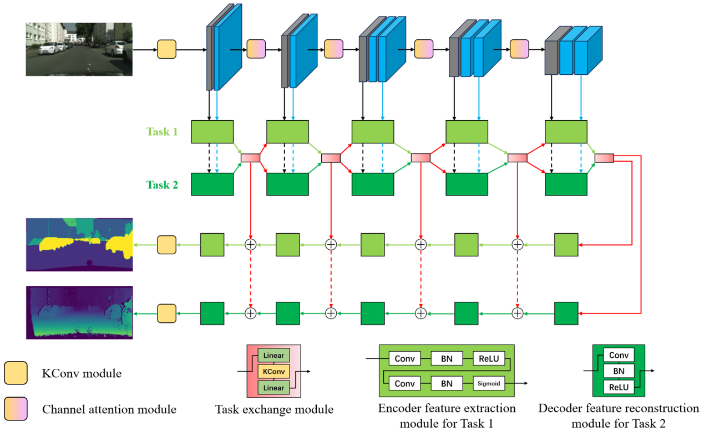

# Net-LAK-MTL
# Net-Opt-MTL
A Multi Task Learning Model Applied to Computer Vision
## Network Framework Diagram (VMSANet)

<p align="center">
  
</p>

## 1. Preparation
We provide pytorch compressed files for Ubuntu environment (recommended to use virtual environment)

Python 3.8 (Ubuntu 18.04)

Cuda  11.1

### requirement

numpy==1.26.4

torch==2.4.0

## 2. Datasets

* **CITYSCAPES**: The preprocessed (normalized) Cityscapes dataset. Click [Cityscape](https://www.dropbox.com/scl/fi/wfmmk8tjn631723e0ycwm/Cityscapes.zip?rlkey=eyjw0vg9l48yvg77g0hm69y7z&st=y40g2ivx&dl=0) to download.
  ```
  <Cityscapes>/                     % Cityscapes dataset root (128 × 256 × 3)
      |
      ├── train/
      |     ├── image/              % Input image
      |     ├── label/              % Semantic segmentation labels (7 categories)
      |     └── depth/              % Depth estimation label
      |
      └── val/
            ├── image/              % Input image
            ├── label/              % Semantic segmentation labels (7 categories)
            └── depth/              % Depth estimation label
  ```


## 3. Program running

- Single task learning baseline:
  ```
  python Single_task.py --task=semantic/depth/...
  ```
  
- Other multi-tasks learning:
  ```
  python model_name.py
  ```
We also provide additional model downloads, including Cross-Stitch, MTRAN, Multi-Task, and Single-Task models. If needed, feel free to click [Other models](https://www.dropbox.com/scl/fi/y5je8fgfh3eq2gblbav84/Other_models.zip?rlkey=mhxmfqda6vuza3j22rxv2ngls&st=lima94gl&dl=0) to download them.
